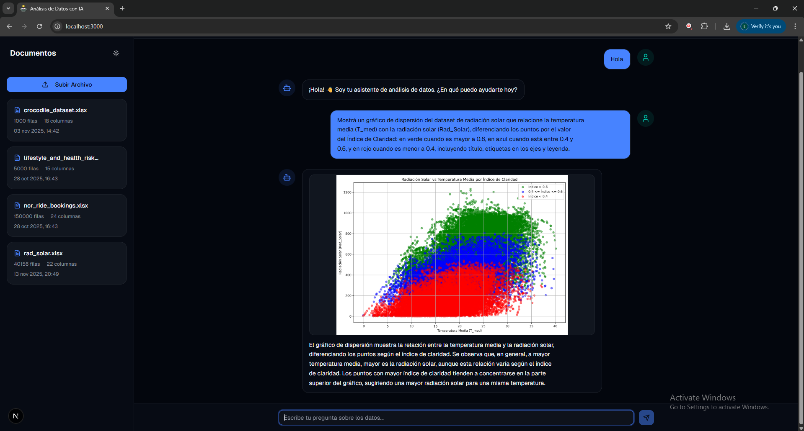
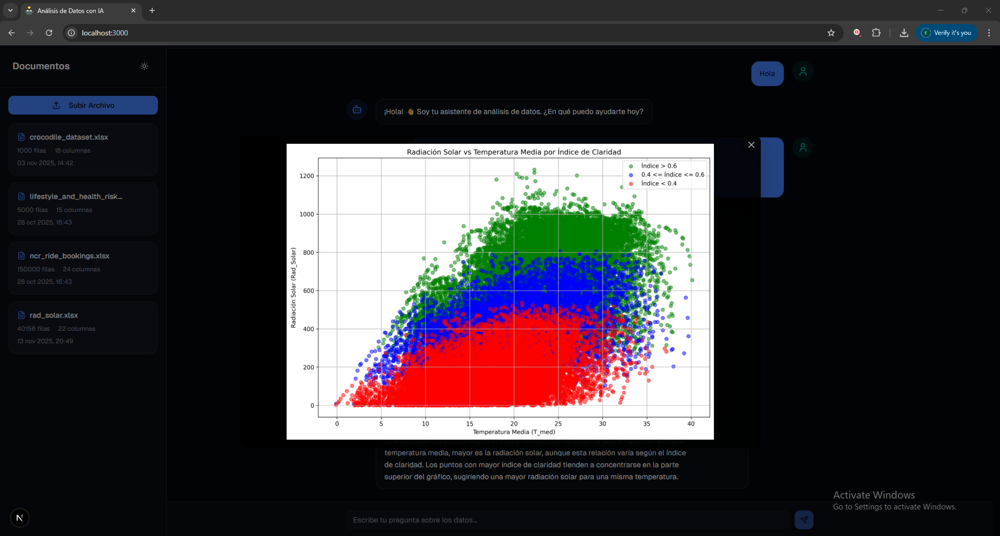
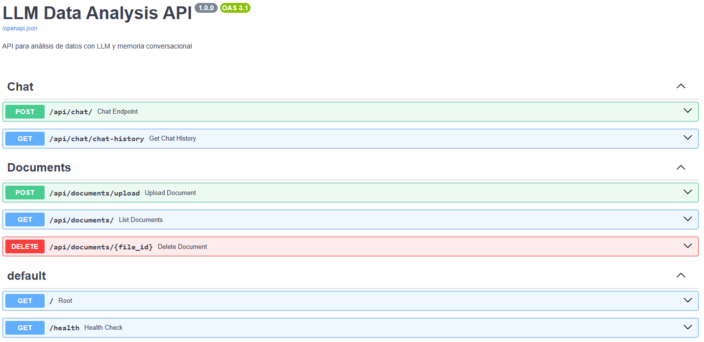

# EDAI - AI-Assisted Data Explorer

[](https://www.python.org/)
[](https://fastapi.tiangolo.com/)
[](https://www.postgresql.org/)

> **⚠️ Important Note:** This repository contains only the **backend** of the EDAI project. For the complete system functionality, you also need to set up the **frontend**, available at: [EDAI Frontend Repository](https://github.com/FernandoBlancoTFL/edai-llm-frontend)

---

## 🚀 Website Deployment

You can see the project up and running at the following link:  
[🔗 View Demo](https://edai-ktcn34pp4-fernandoblanco004-6824s-projects.vercel.app/)

---

## 📸 Screenshots

### Generated data visualization


### Visualization zoom


### API view


---

## 📋 Description

**EDAI** (AI-Assisted Data Explorer) is an innovative web platform that enables data analysis through **natural language**, eliminating the need for technical knowledge in programming or statistics. Developed as a **Professional Integrative Project (PIP)** at Universidad Nacional Arturo Jauretche (UNAJ).

The system uses **Large Language Models (LLMs)** in a multi-agent architecture to interpret queries, execute analysis, and automatically generate visualizations, democratizing access to exploratory data analysis.

---

## 🎯 Key Features

- ✅ **Conversational analysis**: Perform queries in natural language without writing code
- ✅ **Automatic graph generation**: Histograms, scatter plots, heat maps, clustermaps and more
- ✅ **Multi-agent architecture**: Two specialized LLM agents working coordinately
- ✅ **Conversational memory**: Remembers previous interactions and learns user patterns
- ✅ **Adaptive strategy**: Automatic selection between SQL queries and DataFrame processing
- ✅ **Fallback system**: Automatic error recovery with up to 3 retries
- ✅ **Intelligent deduplication**: Duplicate file detection using SHA-256 hashing
- ✅ **Modern and responsive interface**: Adaptable design for desktop, tablet and mobile with light/dark mode

---

## 🏗️ System Architecture

### General Structure

```
EDAI/
├── src/                          # Backend (FastAPI + Python)
│   ├── api/                      # HTTP exposure layer
│   │   ├── routes/               # Endpoint controllers
│   │   │   ├── chat.py          # Conversational interaction endpoint
│   │   │   └── documents.py     # Document management endpoints
│   │   ├── schemas/              # Validation models (Pydantic)
│   │   └── main.py              # FastAPI initialization
│   ├── services/                 # Business logic
│   │   ├── chat_service.py      # Query processing
│   │   └── document_service.py  # File management
│   ├── nodes.py                  # LangGraph graph nodes
│   ├── graph.py                  # Execution flow definition
│   ├── state.py                  # Shared agent state
│   ├── tools.py                  # Analysis and visualization tools
│   ├── prompts.py                # Dynamic prompt construction
│   ├── memory.py                 # Conversational memory system
│   ├── database.py               # PostgreSQL management
│   ├── dataset_manager.py        # Dataset loading and storage
│   ├── multi_dataset.py          # Intelligent dataset selection
│   ├── checkpoints.py            # State persistence (PostgresSaver)
│   ├── config.py                 # Global configuration
│   └── utils.py                  # Auxiliary utilities
│
├── outputs/                      # Generated graphs (.png)
├── requirements.txt              # Python dependencies
└── README.md                     # This file
```

### Multi-Agent Architecture

The system implements a **hybrid architecture** with two specialized LLM agents:

**1. GPT-OSS-120B** (via Groq)
- **Role**: Semantic understanding agent
- **Function**: Generates semantic descriptions of datasets and selects the most relevant dataset through semantic matching

**2. Gemini 2.0 Flash** (Google)
- **Role**: Executor and reasoning agent
- **Function**: Processes queries, selects tools, generates Python/SQL code and produces visualizations

---

## 🛠️ Technologies Used

- **Python 3.9+**: Main language
- **FastAPI**: High-performance asynchronous web framework
- **LangChain**: Integration with language models
- **LangGraph**: Multi-agent conversational flow orchestration
- **PostgreSQL**: Database for storage and checkpoints
- **Pandas**: Data manipulation and analysis
- **Matplotlib/Seaborn**: Visualization generation
- **Psycopg**: PostgreSQL connector
- **Pydantic**: Data validation
- **Google Generative AI**: Client for Gemini 2.5 Flash
- **Groq**: Client for GPT-OSS-120B

---

## 🚀 Installation and Configuration

### Prerequisites

- Python 3.9 or higher
- Node.js 18+ and npm/pnpm
- PostgreSQL 15+
- API Keys:
  - [Google AI Studio](https://aistudio.google.com/app/apikey) (Gemini)
  - [Groq Console](https://console.groq.com/keys) (GPT-OSS-120B)

### 1. Clone the Repository

```bash
git clone https://github.com/FernandoBlancoTFL/edai-llm-backend.git
cd edai-llm-backend
```

### 2. Configuration

#### 2.1 Create Python virtual environment

```bash
python -m venv venv

# Windows
venv\Scripts\activate

# Linux/Mac
source venv/bin/activate
```

#### 2.2 Install dependencies

```bash
pip install -r requirements.txt
```

#### 2.3 Configure PostgreSQL

Create database:

```sql
CREATE DATABASE edai_db;
CREATE USER edai_user WITH PASSWORD 'your_secure_password';
GRANT ALL PRIVILEGES ON DATABASE edai_db TO edai_user;
```

#### 2.4 Configure environment variables

The project includes a `.env.example` file as a template. Copy it and rename it to `.env`, then fill in your configuration values:
```bash
# Copy the example file
cp .env.example .env
```

Edit the `.env` file with your actual values:
```env
# PostgreSQL Configuration
POSTGRES_HOST=localhost
POSTGRES_PORT=5432
POSTGRES_USER=edai_user
POSTGRES_PASSWORD=your_secure_password
POSTGRES_DB=edai_db

# External APIs
GOOGLE_API_KEY=your_gemini_key_here
GROQ_API_KEY=your_groq_key_here
```

**Note**: Never commit the `.env` file to version control. Only `.env.example` should be tracked by git.

#### 2.5 Run backend

```bash
# From project root
uvicorn src.api.main:app --reload --host 0.0.0.0 --port 8000
```

Backend will be available at: `http://localhost:8000`  
Interactive documentation (Swagger): `http://localhost:8000/docs`

---

## 📖 User Guide

### 1. Data Loading

1. Click **"Upload File"** in the sidebar
2. Select **CSV** or **Excel** file (.xlsx, .xls)
3. Wait for confirmation: *"File uploaded successfully"*
4. The system automatically generates a **semantic description** of the dataset

**Note**: The system detects duplicate files using SHA-256 hashing and notifies the user.

### 2. Making Queries

#### a) General Interaction
```
- "hello"
- "what can you do?"
- "help"
- "thanks"
```

#### b) Dataset Queries
```
- "What are the columns of the crocodile dataset?"
- "Give me the first 5 records of the trips dataset"
- "Average Booking Value for UPI payments"
- "How many crocodiles weigh more than 100 kg?"
- "Describe the statistics of the solar radiation dataset"
```

#### c) Graph Generation
```
- "Generate a histogram of Booking Value"
- "Scatter plot between num_hora and Rad_Solar"
- "Show correlation clustermap of the dataset"
- "Scatter plot of Rad_Solar vs num_dia with colors by Clarity Index"
- "Pie chart of Payment Method distribution"
```

### 3. Advanced Features

- **Conversational memory**: The system remembers previous interactions and learns usage patterns
- **Automatic dataset selection**: If you have multiple files loaded, the system identifies which is relevant for your query
- **Intelligent fallback**: If an SQL strategy fails, it automatically retries with DataFrames
- **Graph zoom**: Click on any generated graph to enlarge it

---

## 👥 Author

**Fernando Jose Blanco**  
📧 fernando.blanco004@gmail.com  
🎓 Computer Engineering - Universidad Nacional Arturo Jauretche (UNAJ)

### Academic Supervision

- **Organizational Tutor**: Prof. Dr. Marcelo Ángel Cappelletti
- **Supervisor Professor**: Prof. Eng. Lucas Maximiliano Olivera
- **Program Coordinator**: Dr. Eng. Morales, Martín

---

## 📄 License

This project was developed as a **Professional Integrative Project (PIP)** at Universidad Nacional Arturo Jauretche (UNAJ) under the Student Research Initiation Scholarship (BIEI) program.

---

<div align="center">

⭐ **If you found this project useful, consider giving it a star on GitHub** ⭐

</div>